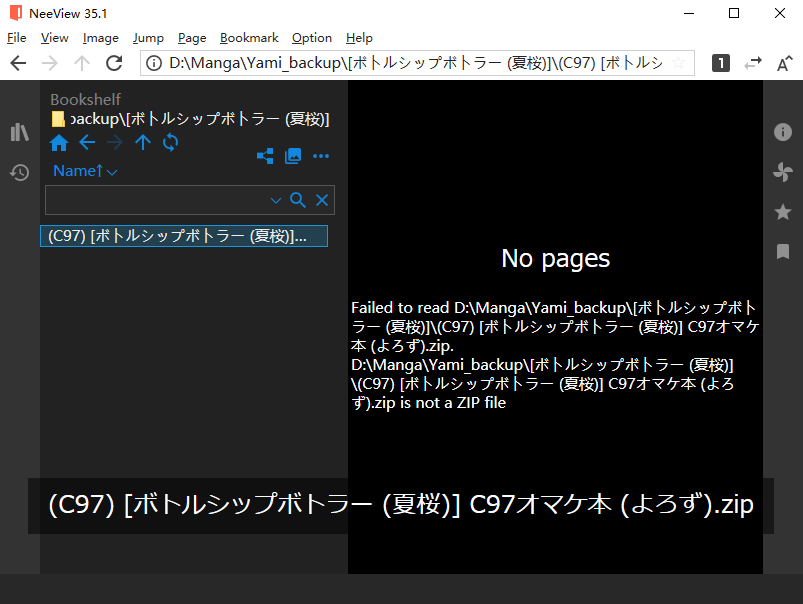
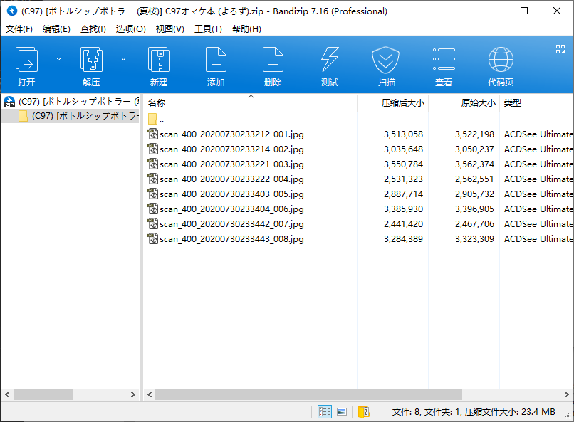
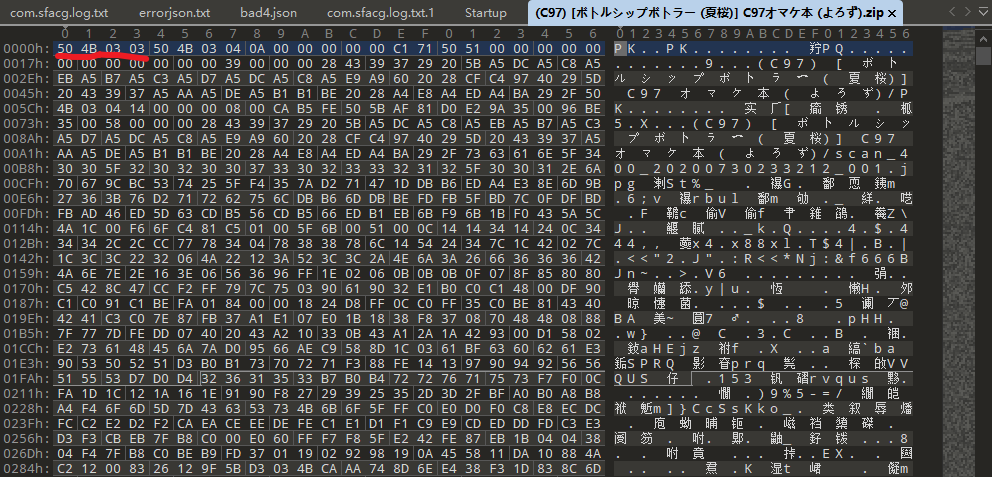

# fix_33_header_zip_tool
*修复以0x03034b50开头的非标准zip文件小工具*

- [Record](#record)
- [Feature](#feature)
    - [功能点](#功能点)
    - [Implement](#implement)
        - [manga_lib/file_util.h](#manga_lib/file_util.h)
        - [manga_lib/check_header_util.h](#manga_lib/check_header_util.h)
        - [manga_lib/binary_manipulation.h](#manga_lib/binary_manipulation.h)
- [Environment](#environment)

## Record

### 缘起

在使用 [NeeView](https://bitbucket.org/neelabo/neeview) 的时候，打开某些zip文件会提示此文件非ZIP文件，然而用Bandizip是可以正常打开的。深入研究后发现打不开的zip文件的文件头（Magic Number）并非[ZIP标准定义](https://pkware.cachefly.net/webdocs/casestudies/APPNOTE.TXT) 的0x04034b50。

推测有的压缩软件出于业务需要，在文件头中加入了自己的压缩标识。而Bandizip能够正确读取内容，要么是它特别兼容了这种0x03034b50的非标准zip文件头，要么就是通过**End of central directory record**获取的zip内容信息。

### 猜想

删去头部0x03034b50的4个字节的非标准文件头后，Bandizip和NeeView均显示zip文件已损坏，所以不能直接删除处理。翻看zip标准定义，发现在中间目录和尾部中间目录记录中，均存有zip内容的偏移量。因为删去了头部4个字节，故而应该在此两处偏移量值处各减去4。

编写[二进制脚本](FixChineseCompressZip.1sc)删除非标准zip文件头4个字节，再修改2处偏移量。处理完后Bandizip和NeeView均能正确读取，验证成功。

因为需要处理漫画目录下大量的0x03034b50开头的zip文件，遂有此工具。

## Feature

### 功能点

- [x] 读取整个目录下的所有zip文件
- [x] 找出符合0x03034b50头部的zip文件
- [x] 能够按通配符列表或筛选条件选取目标文件
- [x] 复制备份要修改的文件，并保留原目录结构
- [x] 原地删除选取的zip文件的头部错误字节，并修改相应的偏移量
- [ ] 可拖拽施放选取路径的UI

### Implement

#### manga_lib/file_util.h

[manga_lib/file_util.h](manga_lib/file_util.h)

##### enum FileSelector::SEL_TYPE

路径类型筛选。

- FILE  =0B0001
- FOLDER=0B0010

##### FileSelector::listPathFiles(path,recurFlag,selType,wildcard)

遍历指定目录下的内容，筛选返回集合。

param:
1. path  开始遍历的根目录
2. recurFlag  是否递归遍历子目录，默认true
3. selType  遍历选取FILE或FOLDER，默认FILE
4. wildcard  以字符‘|’隔开的通配符列表筛选路径结果

return:
- pathList  遍历选取的路径集合

##### FileSelector::copyFiles(fileList,commonParentDir,dstPath,prefixFolderFlag)

复制备份指定文件。

param:
1. fileList  需要被复制备份的文件路径集合
2. commonParentDir  它们的公共根路径，在此之下的目录结构可被复制保留
3. dstPath  复制的目标路径
4. prefixFolderFlag  是否在备份文件时一同备份它们所在的文件夹结构

return:
- copiedFiles  备份成功的文件的新路径

#### manga_lib/check_header_util.h

[manga_lib/check_header_util.h](manga_lib/check_header_util.h)

##### FileHeader::pickMagicNumberFile(fileList,offset,assumeHeader,assumeSize);

从文件集合中选取在指定处含指定字节的文件。

param:
1. fileList  需要检测字节匹配的文件
2. offset  开始匹配的偏移量
3. assumeHeader  需要匹配的字节
4. assumeSize  需要匹配的字节长度

return:
- matchedFiles  匹配到指定字节的文件路径集合

#### manga_lib/binary_manipulation.h

[manga_lib/binary_manipulation.h](manga_lib/binary_manipulation.h)

##### BinaryManipulation::fix33HeaderZip(badHeaderFiles)

修复0x03034b50开头的非标zip文件。

param:
1. badHeaderFiles  以0x03034b50开头的非标准zip文件

return:
- fixedFiles  修复成功的文件路径集合

## Environment

目前只用到了CPP20标准库编写

在MSVC amd64 14.27.29110上编译运行

制作UI界面后会增加对QtWidget的依赖